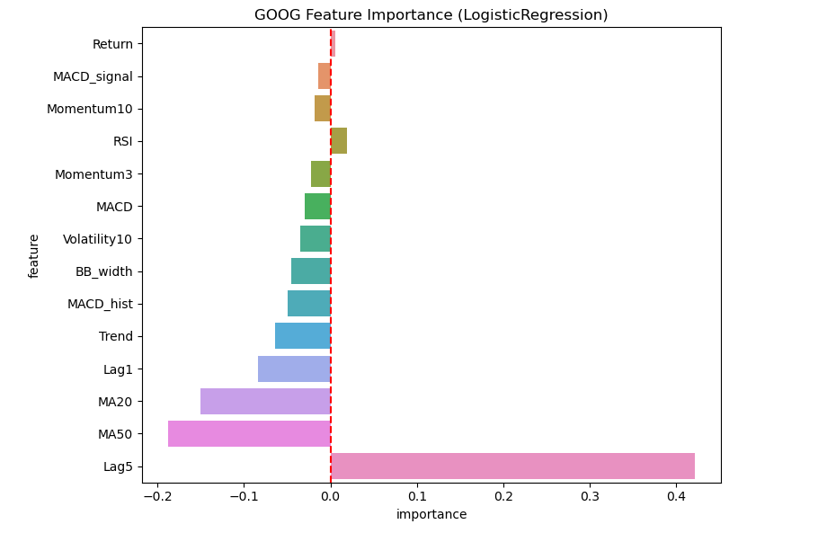
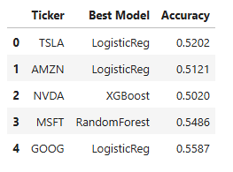
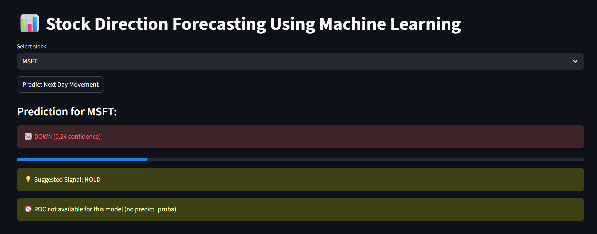
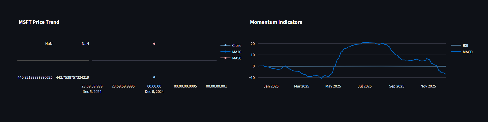
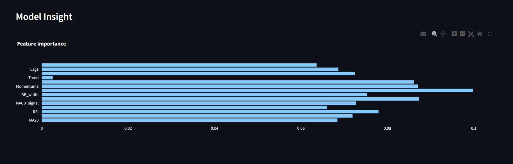
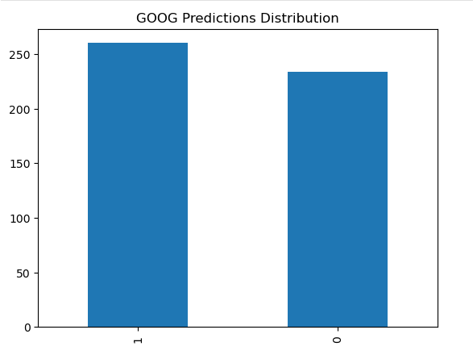
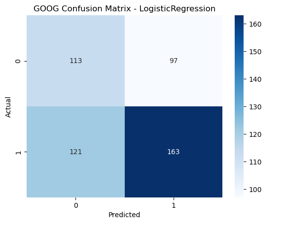
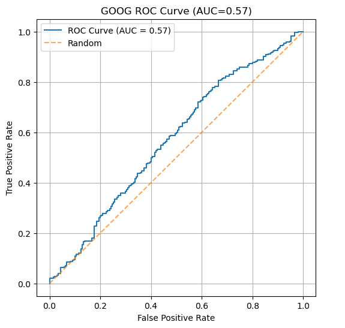

# Stock Direction Forecasting Using Machine Learning

Financial markets are full of uncertainty, and predicting stock movements is one of the most challenging problems in quantitative finance.  
This project explores that challenge by attempting to forecast the next-day direction of stock prices (UP or DOWN) using historical data and technical indicators.

Rather than estimating real price values, the goal here is to determine whether a stock is likely to **increase or decrease on the following trading day** — a simpler, yet still meaningful, prediction problem.

The system uses machine learning models trained on carefully engineered features and exposes the predictions through an **interactive dashboard**.  
It is not designed to be a trading system, but rather a demonstration of an **end-to-end ML pipeline for financial time series**.

---

##  Project Overview

The project is built around five core ideas:

- Fetch historical stock data from Yahoo Finance
- Engineer technical indicators as predictive features
- Train ML models to classify stock direction
- Save the best models for each stock
- Deploy predictions in an interactive dashboard

The models classify each date as either:

- **1 → UP (price increase next day)**
- **0 → DOWN (price decrease next day)**

A confidence score accompanies each prediction, along with a simple trading suggestion.

---

##  Motivation

Financial markets are noisy, chaotic, and driven by events that are difficult — sometimes impossible — to model.  
However, historical price movements often exhibit **short-term patterns** that can be captured by time-series features.

This project was created to explore that idea in a practical way and to apply machine learning beyond notebook experimentation — into deployment.

More than anything, it is a learning project aimed at practicing:

- Real data collection  
- Feature engineering  
- Model comparison  
- Model persistence  
- Real-time inference  
- Building a user interface  

---

##  How It Works (Pipeline)

The ML workflow can be summarized in three steps:

### 1.Data Collection

Stock OHLCV data is downloaded programmatically using `yfinance`.

---

### 2.Feature Engineering

The raw data is transformed into technical indicators such as:

- Moving Averages (20, 50)
- RSI
- MACD, Signal, Histogram
- Bollinger Band Width
- Momentum (3, 10)
- Trend and Volatility
- Lag Values (1, 5)

These indicators attempt to quantify **trend, momentum, and volatility**.

> Example Feature Importance visualization:

---

### 3.  Modeling and Prediction

Multiple models were tested — including:

- Logistic Regression
- Random Forest
- XGBoost

The **best performer for each stock was saved**.

Model comparison example:

The dashboard loads the appropriate model for inference and outputs:

- Prediction (UP / DOWN)
- Confidence score
- Suggested signal: **BUY / SELL / HOLD**

---

## Dashboard

The dashboard provides a real-time interface to explore predictions and visualizations.

High-level interface:

  

It includes:

---

### Price Trend Visualizations

  

---

### RSI and MACD Indicators

  

---

### Feature Importance (When Supported)

  

---

### Confidence Meter

  

---

### Suggested Action Based on Probability

  

---

## Model Performance Metrics

### ROC Curve

  

---

## Summary

This project demonstrates a practical, end-to-end ML pipeline for financial time series:

- Automated data ingestion  
- Feature engineering  
- Multi-model training  
- Model persistence  
- Real-time inference  
- Dashboard deployment  

It highlights how machine learning can be used to explore patterns in noisy financial data and generate simple trading signals.

